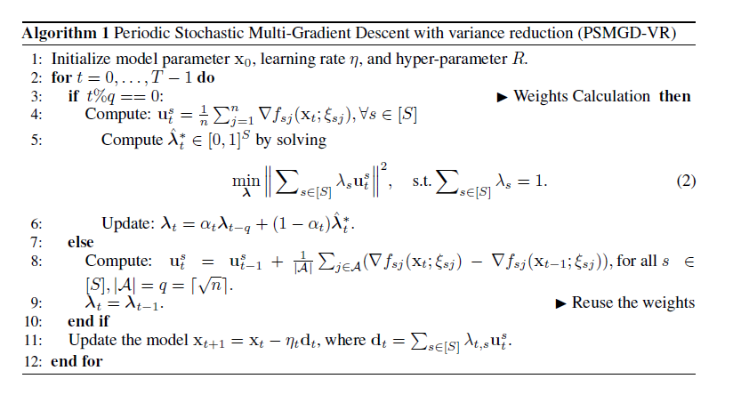

In the algorithm, we have per task $\gamma_s$; how are they calculated? Are they calculated the same as MGDA?

Is the LibMTL's implementation of MGDA also stochastic? No, but as discussed [here](https://proceedings.neurips.cc/paper_files/paper/2023/hash/0e5b96f97c1813bb75f6c28532c2ecc7-Abstract-Conference.html), we can directly make it stochastic if we could tolerate **biased multi-gradient** estimation. 

* First assumption: $\alpha$ is constant. We can learn it later.

Some questions:


* Inherently, we are not doing SMGD, but mini-batched MGDA. If the condition is true $t \% q ==0$, we go over the whole dataset (MGDA) (or batch?). But this happens every q steps. Otherwise, we decrease the mini-batch size considering a batch_size of $\sqrt{n}$. In the second scenario, our mini-batched GD has [momentum](https://en.wikipedia.org/wiki/Stochastic_gradient_descent) ($u_t^s = u_{t-1}^s + \Delta $). Why is that? Only for faster convergence? Is it guaranteed?

Implementation challenges:

1) I believe we receive the gradients with the wrong shape as non of the methods are stochastic. This is fine for case 1 but might not be true for case 2. The processing is in minibatches. 

2) How do we sample $|A|$?

3) What is *rep_grad* and *per_grad*?

4) Why does the second condition have $\Delta f_{t-1}$?

5) `n` is mini-batch size not the total dataset size, correct? 

I don't want to short-circuit the code. I want to fully understand it and then add our contribution.

6) We are only economizing the sample gradients but as read in the MGDA paper, one of the main bottlenecks is per-task backward passes. Can't we do anything about this?

7) There are 3 tasks in the nyu dataset. Does this mean that n = 9?
Observations:

1) `_get_grads` only calculates the gradients for shared and specific parameters.

2) `trainer` controls the backward from outside, not vice versa. Therefore, it always feeds the mini-batch gradients to the weighting method and then immediately updates the shared model weights. So MGDA is mini-batched GD. See LibMTL's source [git](https://github.com/isl-org/MultiObjectiveOptimization) for this algorithm to make sure.

3) If we want to simply alternate the batch sizes, we do not have a straight-forward way without modifying trainer: 
a) returning zero gradients for every batch from the weighting method until the epoch is complete and we have accumulated all the data losses. 
b) having two data_loaders for our algorithm. In trainer, count the steps and if we are in a certain updating step, use the other data loader. Basically, we loop the steps not the minibatches. Right now, the $x_t$ is updated after each mini_batch. So overall, it's not a simple addition of another *weighting.py*.

```python
w = self.model.backward(train_losses, **self.kwargs['weight_args'])
if w is not None:
    self.batch_weight[:, epoch, batch_index] = w
self.optimizer.step()
```

4) Motivation for the new library: support for stochastic methods, mutli GPU and acceleration support. Multi-GPU across tasks across batches.

5) We do not need to worry about hyperparameters (like n, alpha)

6) Take a look at [this](https://pymoo.org/)

Questions:
1) If every case satisfied the first if, would $u_{t-1}$ be equal to $g_t - 1$

Issues:
* cannot run for big batches: i.e. 64; max achieved was 50.

To look at:
[pmoo](https://pymoo.org/)

## Why I am not returning anything in the backward function?